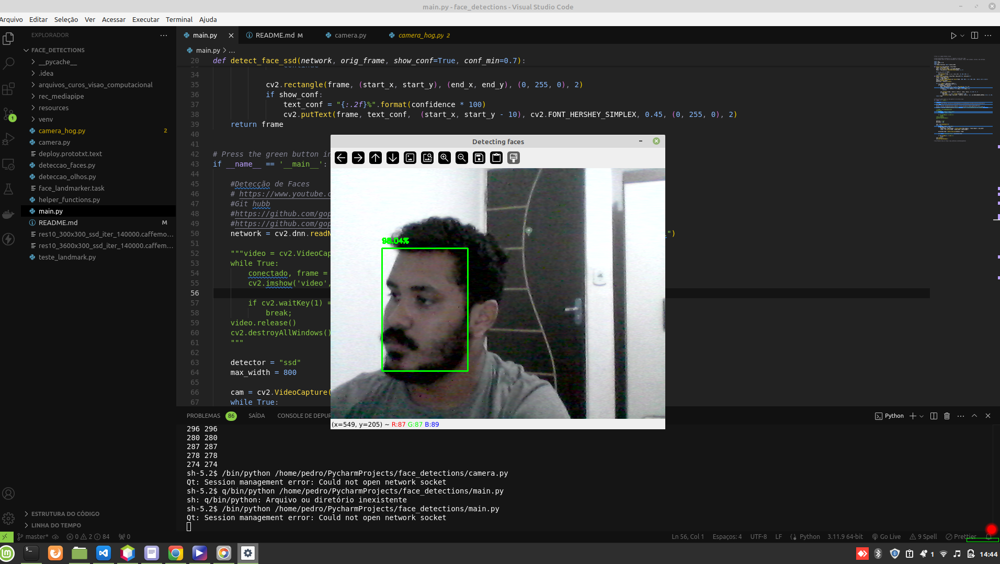
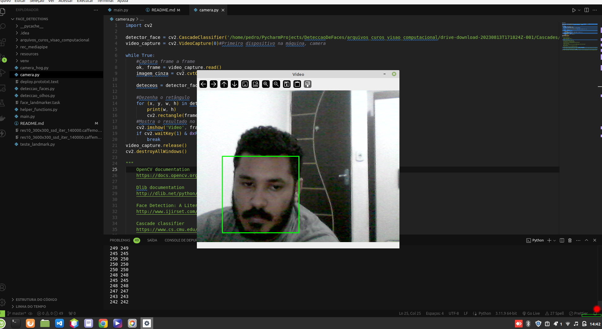

# Face Detections

This project implements face detection using both Single Shot Multibox Detector (SSD) and Haarcascade in Python 3. The goal of this project is to provide robust face detection models that can be easily integrated into various applications.

## Table of Contents

- [Project Overview](#project-overview)
- [Requirements](#requirements)
- [Installation](#installation)
- [Usage](#usage)
  - [SSD Model](#ssd-model)
  - [Haarcascade Model](#haarcascade-model)
- [Screenshots and Video](#screenshots-and-video)
- [Contributing](#contributing)
- [License](#license)

## Project Overview

The "Face Detections" project provides two methods for detecting faces in images or video streams:

1. **SSD (Single Shot Multibox Detector)**: A deep learning-based approach using a pre-trained SSD model.
2. **Haarcascade**: A classical computer vision method using Haar feature-based cascade classifiers.

Both methods are implemented in Python 3 and can be used interchangeably depending on the use case requirements.

## Requirements

To run this application, you will need the following:

- Python 3.6 or higher
- OpenCV (cv2)
- NumPy
- TensorFlow (for SSD)
- imutils (optional, for video stream handling)

You can install the required packages using the following command:

```bash
pip install opencv-python-headless numpy tensorflow imutils
```

## Installation

1. **Clone the repository:**

   ```bash
   git clone git remote add origin https://github.com/pedro162/face_detections.git
   cd Face-Detections
   ```

## Usage

### SSD Model

To detect faces using the SSD model and our webcam:, run the following command:

```bash
python main.py
```

To detect faces using the Haarcascade model and our webcam:, run the following command:

### Haarcascade Model

For real-time face detection using your webcam:

```bash
python camera.py
```

## Screenshots and Video

### SSD Model Detection



### Haarcascade Model Detection



### Video Demonstration


## Contributing

Contributions are welcome! If you have suggestions for improvements or new features, feel free to submit a pull request or open an issue.

## License

This project is licensed under the MIT License.

```

```
